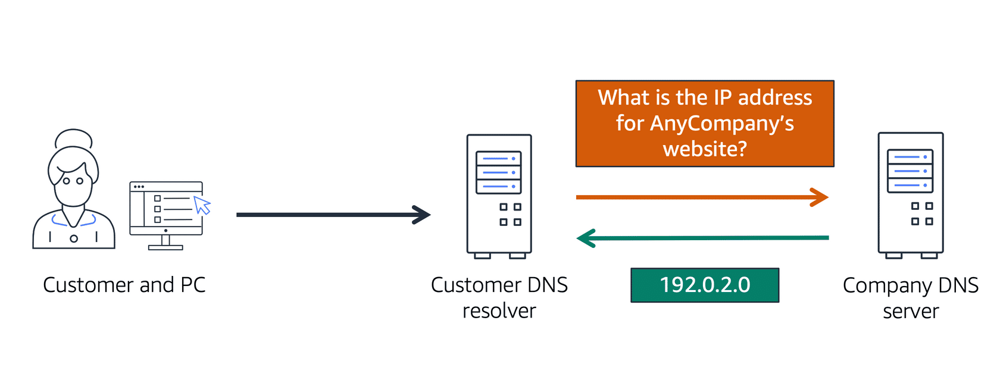

# AWS Certified Cloud Practitioner Certification - My Notes

## Deployment Models for Cloud Computing
- Cloud-Based Deployment
- On-Premises Deployment
- Hybrid Deployment

## Amazon EC2 Instance Types
- **General Purpose instances**:
    - Balanced computing, memory, and networking
    - Suitable for
        - Web servers, Dev environments, Medium databases
- **Compute-optimized instances**:
    - High **vCPUs to memory** ratio
    - Ideal for
        - Scientific modeling, Batch processing, Gaming server
- **Memory-optimized instances**:
    - Designed for large **in-memory** processing
    - Perfect for
        - In-memory databases, Real-time big data analytics
- **Accelerated computing instances**:
    - Uses hardware accelerators like **GPUs**
    - Targeted for
        - Machine learning, Video processing, High-performance computing
- **Storage optimized instances**:
    - High **sequential read/write** access
    - Great for
        - Distributed file systems and data warehousing

## Amazon EC2 Pricing
- **On-Demand**
    - It is ideal for short-term, irregular workloads that cannot be interrupted
    - No upfront costs or minimum contract apply
    - Pay-as-you-go pricing model
- **Reserved instances**
    - Ideal for **steady state** applications
    - Standard Reserved Instance
        - Requires you to specify:
            - EC2 instance type and size
            - Platform description (Operating System)
            - AWS region  
    - Convertible Reserved Instance
        - If you need different EC2 instance types
        - If you want to run your EC2 instances in different availability zones 
- **Saving plans**
    - Can reduce your EC2 instance costs when you make an **hourly** commitment to an instance family and Region for a 1 year or 3 year term
    - Offers savings of up to **72 percent** compared to On-Demand rates
- **Spot instance**
    - Uses unused Amazon EC2 computing capacity and offer you cost savings at up to 90% off of On-Demand prices
    - Useful for applications that can withstand interruptions
- **Dedicated host**
    - Physical servers fully dedicated to you use
    - Of all the Amazon EC2 options, Dedicated Hosts are the most expensive

## Amazon EC2 Scalability
- Scalability involves beginning with **only** the resources you **need** and designing your architecture to **automatically** respond to changing demand by **scaling out** or **in**
- As a result, you pay for only the resources you use
- **Amazon EC2 Auto Scaling**:
    - Amazon EC2 Auto Scaling enables you to automatically **add** or **remove** Amazon EC2 instances in response to changing application demand
    - Within Amazon EC2 Auto Scaling, you can use two approaches
        - **Dynamic** scaling: Dynamic scaling responds to changing demand
        - **Predictive** scaling: Predictive scaling automatically schedules the right number of Amazon EC2 instances based on predicted demand
    - When launching an application on Amazon EC2 instances, configure the Auto Scaling group. It includes 3 capacity settings
        - Minimum capacity: The **initial** number of EC2 instances launched when the Auto Scaling group is created
        - Desired capacity: Represents the number of instances the group attempts to **maintain**. If not explicitly set, it defaults to the minimum capacity
        - Maximum capacity: The **upper** limit on the number of EC2 instances the group can scale out to in response to changing demands

## Elastic Load Balancing 
- An AWS service that automatically distributes incoming application traffic across multiple resources, such as Amazon EC2 instances
- Load Balancer Role:
    - Acts as a single point of contact for incoming traffic
    - Ensures that workloads are evenly distributed across multiple instances, preventing any single instance from being overwhelmed
- Integration with Amazon EC2 Auto Scaling:
    - As you add or remove Amazon EC2 instances in response to the amount of incoming traffic, it routes to the load balancer first
    - Works alongside Amazon EC2 Auto Scaling to enhance application performance and availability

## Monolithic Applications VS Microservices
- Applications are made of multiple components
    - The components communicate with each other to transmit data, fulfill requests, and keep the application running.
- **Monolithic Applications**
    - Composed of tightly coupled components (e.g., databases, servers, UI, business logic)
    - Failure in one component can lead to failure of other components or the entire application
    - To help maintain application availability when a single component fails, you can design your application through a microservices approach
- **Microservices**
    - Components are loosely coupled
    - Failure in one component does not bring down the entire application
    - AWS services that support microservices:
        - Amazon **SNS** – Enables event-driven messaging
        - Amazon **SQS** – Manages message queues for decoupling services

## Amazon Simple Notification Service (Amazon SNS)
- Amazon SNS is a publish/subscribe service --> A publisher publishes messages to subscribers
- Allows applications to send messages to multiple subscribers (e.g., email, SMS, Lambda, SQS) simultaneously

## Amazon Simple Queue Service (Amazon SQS)
- Using Amazon SQS, you can send, store, and receive messages between software components, without losing messages or requiring other services to be available
- In Amazon SQS
    - An application sends messages into a queue
    - A user or service retrieves a message from the queue, processes it, and then deletes it from the queue

## Additional Compute Services
- **1. Serverless Services**
    - Serverless computing means that you don’t manage or see the underlying infrastructure hosting your application
    - Instead AWS fully manages provisioning, scaling, availability, and maintenance
    - Example:
        - AWS Lambda
- **2. Container Services**
    - If you’re not ready for serverless computing or need access to the underlying environment, but still want efficiency and portability
    - Containers provide you with a standard way to **package** your application's code and dependencies into a **single** object
    - A container in this case is a **Docker** container
    - Example:
        - Amazon ECS (Elastic Container Service)
            - A highly scalable, high-performance container management system that enables you to run and scale containerized applications on AWS
            - Supports Docker containers
            - Allows API calls to launch and stop Docker-enabled applications 
        - Amazon EKS (Elastic Kubernetes Service)
            - Fully managed service that you can use to run Kubernetes on AWS  
- **Choosing the Right AWS Compute Service**
    - **1. Amazon EC2 (Elastic Compute Cloud)**
        - Best for hosting traditional applications
        - Provides full access to the underlying OS (Linux or Windows)
    - **2. AWS Lambda (Serverless)**
        - Best for short-running functions, service-oriented, or event-driven applications
        - No need to manage servers or the underlying environment
    - **3. Running Containers on AWS**
      - First, choose your orchestration tool:
          - Amazon ECS – Simpler, AWS-native container orchestration
          - Amazon EKS – Managed Kubernetes for more flexibility.
      - Next, choose your platform:
          - EC2 Instances – You manage the infrastructure
          - AWS Fargate – Serverless (no infrastructure management)

## AWS Lambda
- Allows you to upload your code into what's called a Lambda function
- Lets you run code without needing to provision or manage servers
- Configure a **trigger** for the lamda function, the service waits for the trigger
- When the trigger is detected, the code is automatically run in a managed environment
- Lambda will scale your function to meet demand
- Lambda is designed to run code **under 15 minutes** so this isn't for long running processes like deep learning
    - It's more suited for quick processing where each invocation of the function takes less than 15 minutes to complete
- Pay only for the compute time that you consume

## AWS Global Infrastructure 
- Throughout the globe, AWS builds Regions to be closest to where the business traffic demands
- Inside each Region, we have multiple data centers that have all the compute, storage, and other services you need to run your applications
- Each Region can be connected to each other Region through a high speed **fiber** network, controlled by AWS  

- **Region**
    - One of the first decisions you get to make is which Region do you pick for your services, data, and applications
        - **1. Compliance with governance and legal requirements**
            - Depending on your company and location, you might need to run your data out of specific areas
            - For example, if your company requires all of its data to reside within the boundaries of the UK, you would choose the London Region
        - **2. proximity to your customers**
            - Selecting a Region that is close to your customers will help you to get content to them faster
            - For example, your company is based in Washington, DC, and many of your customers live in Singapore
                - You might consider running your infrastructure in the Virginia Region to be close to company headquarters, and run your applications from the Singapore Region 
        - **3. Available Services Within a Region**
            - Sometimes, the closest Region might **not** have **all** the AWS features that you want, forcing to pick the region that has the required AWS feature
            - AWS is frequently innovating and expanding on existing features 
            - However, making new services available around the world sometimes requires AWS to build out physical hardware one Region at a time
        - **4. Pricing**
            - The cost of services can vary from Region to Region
            - Suppose that you are considering running applications in both the United States and Brazil
            - The way Brazil’s tax structure is set up, it might cost 50% more to run the same workload out of the São Paulo Region compared to the Oregon Region

    - **Availability Zones**
        - An Availability Zone is a **single** data center or a **group** of data centers within a **Region**
        - Availability Zones are located tens of miles apart from each other
        - This is close enough to have low latency but distant enough to reduce the chance that multiple Availability Zones are affected
        - A best practice is to run applications across at least **two** Availability Zones in a **Region**

    - **Edge Locations**
        - Stores **cached** copies of your content closer to your customers for faster delivery
        - Example:
            - Suppose that your company’s data is stored in Brazil, and you have customers who live in China
            - To provide content to these customers you don’t need to
                - Move all the content to one of the Chinese Regions
                - Requir your customers to get their data from Brazil
            - Instead you can cache a copy locally at an edge location that is close to your customers in China
            - When a customer in China requests one of your files, Amazon CloudFront retrieves the file from the cache in the edge location and delivers the file to the customer

    - **AWS Outposts**
        - Extensd AWS infrastructure and services to different locations including your **on-premises** data center

## How To Provision AWS Services
- Invoke **APIs** to provision, configure, and manage your AWS resources
- In AWS, everything is an API call
- **AWS Management Console**:
    - Web-based user interface
    - Allows users to manage AWS services through a browser
    - Intuitive graphical interface with organized dashboard
    - Suitable for those who prefer a GUI-based interaction
- **AWS CLI (Command Line Interface)**:
    - Provides direct commands for AWS services
    - Can be used on Windows, Mac, and Linux
    - Can automate the actions that your services and applications perform
    - Offers deep functionality and control over services
- **AWS SDK (Software Development Kit)**:
    - Provides libraries in multiple programming languages
    - Enables developers to integrate AWS services into their applications through APIs designed for particular languages
    - Contains tools, documentation, and sample code
- **AWS CloudFormation**:
    -  An infrastructure as code tool that allows you to define AWS resources in a declarative way using **JSON** or **YAML** documents called CloudFormation templates
    - A declarative format like this allows you to define **what** you want to build without specifying the details of exactly **how** to build it 
- **AWS Elastic Beanstalk**:
    - You provide **code** and **configuration settings**
    - Elastic Beanstalk deploys the resources necessary to perform the following tasks:
        - Adjust capacity
        - Load balancing
        - Automatic scaling
        - Application health monitoring

## VPC
- A networking service that you can use to **establish boundaries** around your AWS resources
- Enables you to provision an isolated section of the AWS Cloud
- **Internet Gateway (IGW)**:
    - To allow **public** traffic from the internet to access resources within the VPC
    - Without an internet gateway, no one can access the resources within your VPC
    - Think of an internet gateway as being similar to a doorway that customers use to enter the coffee shop
- **Virtual Private Gateway (VGW)**:
    - Enables you to establish a **VPN** connection between your VPC and a private network, such as an on-premises data center or internal corporate network
    - Allows traffic into the VPC only if it is coming from an **approved** network
        - To access **private** resources in a VPC
- **AWS Direct Connect**:
    - Lets you to establish a **dedicated** private connection between your data center and a VPC
    - Can reduce network costs, increase bandwidth, and provide a more consistent network experience than public internet based connections
    

## Subnets
- A **section** of a VPC in which you can **group** resources based on security needs
- **Private subnet**: Contains resources that should be accessible only through your **private** network, such as a database that contains customers’ personal information and order histories
- **Public subnet**: Contains resources that need to be accessible by the **public**, such as an online store’s website
- In a VPC, subnets can **communicate** with each other
    - For example, you might have an application that involves Amazon EC2 instances in a public subnet communicating with databases that are located in a private subnet.

## Network ACLs (Access Control List)
- A virtual firewall that controls inbound and outbound traffic at the **subnet** level
- Stateless
    - They remember nothing and check packets that cross the subnet border **both** way: inbound and outbound
- By default, network ACL **allows** all inbound and outbound traffic, but you can modify it by adding your own rules  

## Security Group
- A virtual firewall that controls inbound and outbound traffic at the **instance** level
- Stateful
    - They remember previous decisions made for incoming packets
    - So when a packet **response** for that request returns, it **allows** the response to go through regardless of the inbound security group rules 
- By default, a security group **denies** all **inbound** traffic and **allows** all **outbound** traffic

## Global Networking
- **Domain Name System (DNS)**
    - Translates human-readable **domain names** into **IP addresses**, enabling users to access websites
    - DNS resolution involves a customer DNS resolver communicating with a company DNS server
    
- **Content Delivery Network (CDN)**
    - Caches content in multiple locations spread globally
    - When a user requests content, it is served from the nearest edge location instead of the origin server, reducing latency  
- **Route 53**
    - DNS service offered by AWS
    - A reliable way to **route** end users to applications hosted in AWS
        - It connects user requests to infrastructure running **in** AWS as well as **outside** of AWS
    - Route 53 allows you to manage DNS records for domain names
        - Can register new domain names directly in Route 53
        - Also supports transferring DNS records from other domain registrars
- **CloudFront**
    - CDN service offered by AWS
- **How Amazon Route 53 and Amazon CloudFront deliver content**
  - A customer requests data from the application by going to AnyCompany’s website
  - Amazon Route 53 uses DNS resolution to identify AnyCompany.com’s corresponding IP address, 192.0.2.0. This information is sent back to the customer
  - The customer’s request is sent to the nearest edge location through Amazon CloudFront
  - Amazon CloudFront connects to the Application Load Balancer, which sends the incoming packet to an Amazon EC2 instance
     

  

## Instance Store and Amazon Elastic Block Store (EBS)
- **Instance Store**:  
    - A **disk** storage that is **physically** attached to the **host** computer the EC2 instance is running on, and therefore has the **same** lifespan as the instance
    - When the instance is terminated, you **lose** any data in the instance store
    - Best for temporary data 
- **Amazon Elastic Block Store (EBS):**
    - Provides **block-level** storage volumes that you can use with Amazon EC2 instances
    - If you stop or terminate an Amazon EC2 instance, all the data on the attached EBS volume remains available
    - Because EBS volumes are for data that needs to **persist**, it’s important to **back up** the data on **seperate** drives from the local instance
        - You can take incremental backups of EBS volumes by creating Amazon EBS snapshots
        - Incremental Backup:
            - Means that the first backup taken of a volume copies all the data
            - For subsequent backups, **only** the blocks of data that have **changed** since the most recent snapshot are saved 
    

## Amazon Simple Storage Service (Amazon S3)
- An AWS service that offers **object level** storage
    - In Object Level Storage, each object consists of
        - **Data**: Might be an image, video, text document, or any other type of file
        - **Metadata**: Contains information about what the data is, how it is used, the object size, and so on
        - **Key**: Its unique identifier
- S3 stores data as objects in **buckets**
    - Maximum size for an object in Amazon S3 is **5 TB**
- S3 offers unlimited storage space
- **AWS S3 Storage Classes**
    -  When selecting an Amazon S3 storage class, consider these two factors:
        - How **often** you plan to retrieve your data
        - How **available** you need your data to be
    - **S3 Standard:**
        - General-purpose storage class
        - Stores data in a minimum of three Availability Zones
        - Suitable for **frequently** accessed data
            - Makes it a good choice for a wide range of use cases, such as websites, content distribution, and data analytics 
        - Has a **higher** cost than other storage classes intended for infrequently accessed data and archival storage
    - **S3 Standard-Infrequent Access (S3 Standard-IA):**
        - Ideal for data that is **infrequently** accessed but requires high availability when needed
        - Provides the same level of availability as Amazon S3 Standard but with a lower storage price and a higher retrieval price
        - Stores data in a minimum of three Availability Zones
        - Requires a minimum storage duration of 30 days
    - **S3 One Zone-Infrequent Access (S3 One Zone-IA):**
        - Stores data in a **single** AWS Availability Zone for cost savings
        - Requires a minimum storage duration of 30 days.
        - A good storage class to consider if:
            - You want to save costs on storage
            - You can easily reproduce your data in the event of an Availability Zone failure
    - **S3 Intelligent-Tiering:**
        - Ideal for data with **unknown** or **changing** access patterns
        - Requires a small monthly monitoring and automation fee per object
            - Amazon S3 monitors objects’ access patterns
                - If you haven’t accessed an object for 30 consecutive days, Amazon S3 automatically moves it to the infrequent access tier (S3 Standard-IA)
                - If you access an object in the infrequent access tier, Amazon S3 automatically moves it to the frequent access tier (S3 Standard)
    - **S3 Glacier Instant Retrieval:**
        - Works well for archived data that requires **immediate** access
        - Can retrieve objects within a few **milliseconds**
    - **S3 Glacier Flexible Retrieval:**
        - Low-cost storage designed for data archiving
        - Able to retrieve objects within a **1 minute to 12 hours**
    - **S3 Glacier Deep Archive:**
        - Lowest-cost archival storage class
        - Suitable for long-term archiving and **rarely** accessed data (i.e once or twice in a year)
        - Provides data retrieval within **12 to 48 hours**
        - All objects from this storage class are replicated across at least three geographically dispersed Availability Zones
    - **S3 Outposts:**
        - Delivers object storage to your **on-premises** AWS Outposts environment
        - Works well for workloads with **local data residency requirements** that must satisfy demanding performance needs by keeping data close to on-premises applications
    
    
- **S3 pricing is based on four factors**
    - Total amount of data (in GB) stored on S3
    - Storage class (S3 Standard, S3 Intelligent-Tiering, S3 Standard-Infrequent Access, S3 One Zone-IA, S3 Glacier, or S3 Glacier Deep Archive)
    - Amount of data transferred out of AWS from S3
    - Number of requests to S3

## Amazon EBS vs Amazon S3
- **Block Storage Vs Object Storage**
    - **Block Storage**
        - Breaks files into smaller parts (blocks) and stores them separately
        - Each block can be modified independently, enabling partial updates instead of re-uploading the entire file
    - **Object Storage**
        - Treats each file as a complete, discrete object
            - If any change is made to an object, the entire file must be re-uploaded
        - Ideal for storing documents, images, and videos that are uploaded and accessed as whole objects
- **Amazon EBS (Uses Block Storage)**
    -  Example: You have an 80-gigabyte video file that you're making edit corrections on.for that 80-gigabyte file, when you make an edit to one scene in the film and save that change, the engine only updates the blocks where those bits live.  If you were using S3, every time you saved the changes, the system would have to upload all 80 gigabytes, the whole thing, every time.
- **Amazon S3 (Uses Object Storage)**
    - Example: Suppose you're running a photo analysis website where users upload a photo of themselves, and your application finds the animals that look just like them. You have potentially millions of animal pictures that all need to be indexed and possibly viewed by thousands of people at once.  

## Amazon Elastic File Storage (EFS)
- **File Storage**
    - In file storage, multiple clients (such as users, applications, servers, and so on) can access data that is stored in shared file folders
    - Compared to block storage and object storage, file storage is ideal for use cases in which a large number of services and resources need to access the same data at the same time
- EFS is a scalable file system used with AWS Cloud services and on-premises resources
- As you add and remove files, Amazon EFS grows and shrinks **automatically**
    - It can scale on demand to petabytes without disrupting applications

## EBS VS EFS
- **EBS**
    - Stores data in a single Availability Zone
    - To attach an Amazon EC2 instance to an EBS volume, both the Amazon EC2 instance and the EBS volume must reside within the same Availability Zone
    - It doesnot automatically grow and shrink based on demand
- **EFS**
    - It is a regional service --> It stores data in and across multiple Availability Zones
    - The duplicate storage enables you to access data concurrently from all the Availability Zones in the Region where a file system is located

      
## Amazon Relational Database Service (RDS)
- A service that enables you to run relational databases in the AWS Cloud
    - It supports various database engines like MySQL, PostgreSQL, Oracle, Microsoft SQL Server, Amazon Aurora, MariaDB
- Automates tasks such as hardware provisioning, database setup, patching, and backups, allowing to spend less time completing administrative tasks  
- Provides **automated** backups, enabling point-in-time recovery
- Can easily **scale** compute and storage resources to handle increased demand
- Multi-AZ deployment provides **high availability**
- **AWS is responsible for:**
    - Managing the underlying infrastructure and foundation services
    - Managing the operating system
    - Database setup
    - Patching and backups
- **The customer is still responsible for:**
    - Protecting the data stored in databases (through encryption and IAM access control)
    - Managing the database settings that are specific to the application
    - Building the relational schema
    - Network traffic protection
- **Amazon Aurora**
    - It is an enterprise-class relational database
    - It is compatible with MySQL and PostgreSQL relational databases
    - It is up to five times faster than standard MySQL databases and up to three times faster than standard PostgreSQL databases
    - Consider Amazon Aurora if your workloads require **high availability**
        - It replicates **six** copies of your data across **three** Availability Zones and continuously backs up your data to Amazon **S3** 

## Amazon DynamoDB
- **NonRelational Databases**
    - A nonrelational database stores and organizes data **without** using traditional rows and columns
    - Also Known As: NoSQL databases
    - Instead of tables with fixed schemas, they use flexible data models like:
        - {Key,Value} Pairs: **Data** is stored as **keys** (items) and values (attributes/features)
    - Can add or remove attributes from items in the table at any time
    - Additionally, not every item in the table has to have the same attributes 
- Amazon **DynamoDB** is a **key-value** database service
- Provides single-digit **millisecond** performance at any scale
- It is serverless, which means that you do not have to provision, patch, or manage servers
- Supports automatic scaling based on demand without compromising performance 

## RDS Vs DynamoDB
- **RDS**
    - Best for complex data relationships (e.g., sales supply chain management)
    - Can handle **complex joins** across multiple tables 
- **DynamoDB**
    - Most real-world use cases don't require complex joins (e.g., simple look-up tables)
        - Example: Employee contact list (names, phone numbers, emails, IDs) – a single-table structure
    - Relational databases create unnecessary overhead when not using complex relationships
    - DynamoDB eliminates this overhead, making it faster, more scalable, and cost-efficient

      
## Amazon RedShift
- **Why Traditional Databases Struggle with Big Data & Analytics**
    - Designed for **real-time**, high-speed transactions
    - Struggle with historical analytics because data continuously grows 
    - Limited in handling **diverse** data sources 
    - Traditional databases can't efficiently run queries across multiple large datasets
-  **The Need for Data Warehouses**
    - Optimized for **historical data** analysis instead of real-time transactions
    - Can handle massive, growing datasets and complex queries across multiple data sources
    - Example:
        - ✅ "Show me last hour’s sales across all stores" → Data Warehouse (historical)
        - ❌ "How many coffee bags are in stock right now?" → Relational Database (operational)
- **Amazon RedShift**
    - Massively scalable (supports petabyte-scale storage)
    - Redshift Spectrum: Query exabytes of unstructured data in S3 data lakes
    - Up to 10x higher performance than traditional databases for business intelligence workloads
    - Fully managed → Reduces operational overhead (scaling, tuning, maintenance)
    - Easy to deploy → Start with a single API call

      
## AWS Database Migration Service (DMS)
- AWS DMS allows you to easily move your databases to the AWS cloud, from AWS to other platforms, or between different database types
- Supports both heterogeneous (e.g., Oracle to MySQL) and homogeneous (e.g., MySQL to MySQL) database migrations
- It allows you to migrate with minimal interruption by ensuring that your source database continues to operate during migration
- It enables developers to test applications against production data without affecting production users
- It supports combining several databases into a single database
- It sends ongoing copies of your data to other target sources instead of doing a one-time migration

## Additional Database Services
- **Amazon DocumentDB**
    - Fully managed **document** database compatible with MongoDB
    - Best for applications that need flexible, JSON-like document storage
- **Amazon Neptune**
    - Fully managed **graph** database designed for highly connected data
    - Ideal for recommendation engines, fraud detection, and knowledge graphs
- **Amazon QLDB (Quantum Ledger Database)**
    - Ledger database that keeps an immutable history of changes
    - Best for financial transactions, auditing, and tracking data changes
- **Amazon Managed Blockchain**
    - Service for creating and managing blockchain networks
    - Eliminates the need for a central authority in transactions
- **Amazon ElastiCache**
    - Caching service that speeds up database queries
    - Supports Redis & Memcached for low-latency access to frequently used data
- **Amazon DynamoDB Accelerator (DAX)**
    - In-memory **caching** for DynamoDB, reducing response times from milliseconds to microseconds
    - Ideal for high-performance applications needing real-time access to data

      
## AWS Shared Responsibility Model
- **Customer** responsibilities as “security **in** the cloud
    - The customer has complete control over their content
    - They are responsible for managing which content you choose to store on AWS, which AWS services you use, and who has access to that content
    - The customer also control how access rights are granted, managed, and revoked
- **AWS** responsibilities as commonly referred to as “security **of** the cloud”
    - AWS manages the security of the cloud, specifically the physical infrastructure that hosts your resources, which include:
        - Physical security of data centers
        - Hardware and software infrastructure
        - Network infrastructure
        - Virtualization infrastructure 

## AWS Identity and Access Management (IAM)
- Enables you to manage **access** to AWS services and resources
1. **Root User**:
    - When you first **create an AWS account**, you begin with an identity known as the root user
    - Accessed by signing in with the email address and password that you used to create your AWS account
    - It has complete access to all the AWS services and resources in the account
    - Do **not** use the root user for **everyday** tasks
      
2. **IAM User**:
    - Directly associated with an identity in an AWS account
    - Usually created for real **people** or **applications**
    - It consists of a **name** and **credentials**
    - By default, when you create a new IAM user in AWS, it has **no** permissions associated with it
    - To allow the IAM user to perform specific actions in AWS, you must grant the IAM user the necessary permissions
    - Best Practice: Create **separate** IAM users for each individual who needs access to AWS. Even if multiple employees require the same level of access, each user should have their own IAM credentials. This enhances security
3. **User Group**:
    - It is a **collection** of IAM users
    - When you assign an IAM policy to a group, all users in the group are granted permissions specified by the policy
        - Ideal for grouping users with common permissions.
    - For example, if you want to give the same access permissions to all developers, you can group them in a single "Developer" group
4. **Role**:
    - It is an **identity** that you can assume to gain **temporary access** to permissions
    - It is not directly associated with an ID or password, so it cannot be used to log in directly
    - Before an IAM user/application/service can assume an IAM role, they must be granted permissions to **switch** to the role
    - When someone assumes an IAM role, they **abandon** all previous permissions that they had under a previous role and assume the permissions of the new role
    - Best Practice: Ideal for situations in which access to services or resources needs to be granted temporarily, instead of long-term
5. **IAM Policies**
    -  Defines **permissions** for users, groups, and roles
    -  They determine **who** can perform **what** actions on **which** AWS resources

## AWS Organizations
-  A **central** location to manage **multiple** AWS accounts
-  When you create an organization, AWS Organizations automatically creates a **root**, which is the parent container for all the accounts in your organization
-  Allows you to **centrally control permissions** for the accounts in your organization by using **service control policies** (SCPs)
    -  SCPs enable you to place restrictions on the AWS services, resources, and individual API actions that users and roles in each account can access
    -  You can apply SCPs to the organization root, an individual member account, or an OU
        -  An SCP affects all IAM users, groups, and roles within an account, including the AWS account root user
    -  You can apply IAM policies to IAM users, groups, or roles. You **cannot** apply an IAM policy to the AWS account root user
- Allows you to **group accounts** into **organizational units** (OUs)
    - This makes it easier to manage accounts with **similar** business or security requirements
    - When you apply a policy to an OU, all the accounts in the OU automatically inherit the permissions specified in the policy

## AWS Artifact
- Depending on your company’s industry, you may need to **uphold specific standards**
    - An audit or inspection will ensure that the company has met those standards
- AWS Artifact is a service that provides on-demand access to **AWS security and compliance reports** and select online agreements
- AWS Artifact consists of two main sections:
    - **AWS Artifact Agreements**
        - Allows you to **review, accept, and manage agreements** for an individual account and for all the accounts in an AWS Organization
        - Example Use: When your company needs to sign an agreement with AWS regarding your use of certain types of information throughout AWS services
    - **AWS Artifact Reports**
        -  Provides **compliance reports** from third-party auditors
            -  These auditors have tested and verified that AWS is compliant with a variety of global, regional, and industry-specific security standards and regulations
        - Example Use: When a member of your company’s development team is building an application and needs more information about their responsibility for complying with certain regulatory standards. You can advise them to access this information in AWS Artifact Reports
- **Customer Compliance Center**
    - Allows you to read customer compliance stories to discover how companies in regulated industries have solved various compliance, governance, and audit challenges
 

## Denial-Of-Service Attacks
- A deliberate attempt to make a website or application **unavailable** to users
- The attack originates from a **single** source
- Example: An attacker might flood a website or application with excessive network traffic until the targeted website or application becomes overloaded and is no longer able to respond. If the website or application becomes unavailable, this denies service to users who are trying to make legitimate requests
- **Distributed Denial-Of-Service Attacks (DDoS)**
    -  The attack originates from **multiple** sources
    -  Multiple sources are used to start an attack that aims to make a website or application unavailable
    -  This can come from a group of attackers, or even a single attacker. The single attacker can use multiple infected computers (also known as “bots”) to send excessive traffic to a website or application

## AWS Shield
- A service that **protects** applications against **DDoS** attacks
- AWS Shield provides two levels of protection:
    - **Standard**
        - Automatically protects all AWS customers at **no** cost
        - It protects your AWS resources from the most common, frequently occurring types of DDoS attacks
    - **Advanced**
        - A **paid** service that provides detailed attack diagnostics and the ability to detect and mitigate sophisticated DDoS attacks
        - Can integrate AWS Shield with AWS WAF by writing custom rules to mitigate complex DDoS attacks

## Additional Security Services 
- **AWS Key Management Service (AWS KMS)**
    - We need to ensure that the application's data is secure while in storage (**encryption at rest**) and while it is transmitted, (**encryption in transit**)
    - AWS KMS enables you to perform encryption operations through the use of **cryptographic keys**
        - A cryptographic key is a random string of digits used for locking (encrypting) and unlocking (decrypting) data
    - With AWS KMS, you can **control key access** by specifying which IAM users and roles can manage them
        - You can also temporarily disable keys to prevent their use
- **AWS WAF**
    - A **web application firewall** that lets you **monitor** network requests that come into your web applications
    - Uses a web access control list (ACL) to protect your AWS resources
    - When a request comes into AWS WAF, it checks against the list of rules that you have configured in the web ACL
    - Here's an example
      
- **Amazon Inspector**
    - Allows you to perform automated **security assessments**
    - It checks applications for security vulnerabilities and deviations from **security best practices**
    - After Amazon Inspector has performed an assessment, it provides you with a **list** (prioritized by severity level) of security **findings**
    - Also provides a detailed description of each security issue and a recommendation for how to fix it
        - However, AWS does not guarantee that following the provided recommendations resolves every potential security issue
  - **Amazon GuardDuty**
   - A service that provides intelligent threat detection for your AWS infrastructure and resources
   - After you have enabled GuardDuty for your AWS account, GuardDuty begins monitoring your network and account activity
   - If GuardDuty detects any threats, you can review detailed findings about them from the AWS Management Console
   - Findings include recommended steps for remediation
       - You can also configure AWS Lambda functions to take remediation steps automatically in response to GuardDuty’s security findings
  
      

## Amazon CloudWatch
- A web service that enables you to collect, monitor and evaluate various metrics and then use these metrics to make decisions or take actions 
- AWS services send metrics to CloudWatch. CloudWatch then uses these metrics to create graphs automatically that show how performance has changed over time
- **CloudWatch alarms**:
    - Can create alarms to get **notified** or perform **actions** if the value of a metric has gone above or below a predefined threshold
- **CloudWatch **dashboard**:
    - Enables you to access all the metrics for your resources from a single location
    - For example, you can use a CloudWatch dashboard to monitor the CPU utilization of an Amazon EC2 instance, the total number of requests made to an Amazon S3 bucket, and more. You can even customize separate dashboards for different business purposes, applications, or resources.
- **CloudWatch Logs**:
    - Allows you to collect and store logs from your AWS infrastructure in a central location
    - Logs Streams represent source-based sequential streams of these logs
    - **CloudWatch Logs Insights**: A query and analysis tool that makes it easier for you to dive deeper into these logs and analyze them

## AWS CloudTrail
- Enables you to view a complete **history** of user activity and API calls for your applications and resources
- The recorded information includes the identity of the API caller, the time of the API call, the source IP address of the API caller, and more
- Events are typically updated in CloudTrail within **15 minutes** after an API call
- Helps in tracking changes, identifying potential security risks, and troubleshooting
- Within CloudTrail, you can also enable **CloudTrail Insights** to automatically detect **unusual API activities** in your AWS account

## AWS Trusted Advisor
- A web service that **inspects** your AWS environment and provides real-time recommendations in accordance with AWS best practices
- Offers support in five categories: cost optimization, performance, security, fault tolerance and service limits
- For the checks in each category, Trusted Advisor offers a list of recommended actions and additional resources to learn more about AWS best practices

## AWS Free Tier
- Enables you to begin using certain services without having to worry about incurring costs
- Three types of offers are available:
    - **Always Free**
        - These offers do not expire and are available to all AWS customers
        - For example, AWS Lambda allows 1 million free requests and up to 3.2 million seconds of compute time per month. Amazon DynamoDB allows 25 GB of free storage per month
    - **12 Months Free**
        - These offers are free for 12 months following your initial sign-up date to AWS
        - For examples, specific amounts of Amazon S3 Standard Storage, thresholds for monthly hours of Amazon EC2 compute time, and amounts of Amazon CloudFront data transfer out 
    - **Trials**
        - Short-term free trial
        - The length of each trial might vary by number of days or the amount of usage in the service
        - For example, Amazon Inspector offers a 90-day free trial

## How AWS Pricing Works
- Pay only for what you use
- Pay less when you reserve
    - Some services offer reservation options that provide a significant discount compared to On-Demand Instance pricing 
- Pay less with volume based discounts
    - i.e pay less when you use more
    - For example, the more Amazon S3 storage space you use, the less you pay for it per GB 

## AWS Pricing Calculator
- Lets you create an **estimate** for the **cost** of your **use cases** on AWS
- You can organize your AWS estimates by **groups** of your choice
    - A group can reflect how your company is organized

## Billing Dashboard
- Used to
    - Pay your AWS bill
    - Monitor your usage
        - Compare your current month-to-date balance with the previous month, and get a forecast of the next month based on current usage
        - View month-to-date spend by service
        - View Free Tier usage by service
    - Analyze and control your costs
    - Publish AWS Cost and Usage Reports

## Consolidated Billing
- **AWS Organizations**: A service that enables you to manage multiple AWS accounts from a central location
    - The default maximum number of accounts allowed for an organization is 4, but you can contact AWS Support to increase your quota, if needed 
- AWS Organizations also provides the option for consolidated billing enabling you to receive a single bill for all AWS accounts in the organization
- By consolidating
    - You can easily track the **combined costs** of all the linked accounts in your organization
    - You can also review itemized charges incurred by **each** account
        - This enables you to have greater transparency into your organization’s accounts while still maintaining the convenience of receiving a single monthly bill
- Another benefit of consolidated billing is the ability to share bulk discount pricing, Savings Plans, and Reserved Instances across the accounts in your organization
    - Some AWS services, like Amazon S3, offer tiered pricing—lower rates apply as usage increases
    - Example Scenario
        - Three separate AWS accounts transfer 2 TB, 5 TB, and 7 TB of Amazon S3 data
        - Individually, none exceed the 10 TB threshold for discounted pricing
        - When linked under consolidated billing, their combined usage (2 + 5 + 7 = 14 TB) qualifies for the discount
        - AWS applies volume pricing across the organization and distributes the discount proportionally based on each account’s usage
        - Account 3 (7 TB) benefits more than Account 1 (2 TB) or Account 2 (5 TB) since it contributed the most data transfer

## AWS Budgets
- Enables you to **create budgets** in order to plan your service usage, service costs, and instance reservations
- Can also set **custom alerts** when your usage exceeds (or is forecasted to exceed) the budgeted amount

## AWS Cost Explorer
- A tool that lets you **visualize, understand, and manage your AWS costs** and usage over time
- AWS Cost Explorer includes a default **report** of the costs and usage for your top five cost-accruing AWS services
    - You can apply custom filters and groups to analyze your data
-  Offers historical and forecasted cost information
-  Also provides comments about the future by looking at the pas

## AWS Support Plans
### Basic Support
- Free for all the AWS Users
- **Customer Service and Communities:** 24x7 access to customer service, [documentation](https://docs.aws.amazon.com/), [whitepapers](https://aws.amazon.com/whitepapers/), and [AWS re:Post](https://www.repost.aws/)
- **[AWS Trusted Advisor](https://aws.amazon.com/premiumsupport/technology/trusted-advisor/):** Access to limited [Trusted Advisors](https://docs.aws.amazon.com/awssupport/latest/user/trusted-advisor-check-reference.html) and guidance to provision your resources following best practices to increase performance and improve security
- **[AWS Personal Health Dashboard](https://aws.amazon.com/premiumsupport/technology/personal-health-dashboard/):** A personalized view of the health of AWS services, and alerts when your resources are impacted
- **Apart from basic, AWS offers 4 different Support plans to help you troubleshoot issues:**
    - Developer
    - Business
    - Enterprise On-Ramp
    - Enterprise  
### 1. Developer Support
- Offers following features:
    - Best practice guidance
    - Client-side diagnostic tools
    - Building-block architecture support, which consists of guidance for how to use AWS offerings, features, and services together
- Technical support within business days (12 hour response time)
- Technical support through Chat
### 2. Business Support
- Offers following features:
    - Use-case guidance to identify AWS offerings, features, and services that can best support your specific needs
    - **All** AWS Trusted Advisor checks
    - Limited support for third-party software, such as common operating systems and application stack components
- Technical support with 24/7 phone and email access (1 hour response time)
- Unlimited access to AWS Consultants
### 3. Enterprise On-Ramp Support
- Offers following features:
    - A pool of Technical Account Managers (TAMs) to provide proactive guidance and coordinate access to programs and AWS experts
    - A Cost Optimization workshop (one per year)
    - A Concierge support team for billing and account assistance
    - Tools to monitor costs and performance through Trusted Advisor and Health API/Dashboard
- Also provides access to a specific set of proactive support services provided by a **pool** of Technical Account Managers
    - Consultative review and architecture guidance (one per year)
    - Infrastructure Event Management support (one per year)
    - Support automation workflows
    - 30 minutes or less response time for business-critical issues
### 4. Enterprise Support
- Offers following features:
    - A **designated** Technical Account Manager to provide proactive guidance and coordinate access to programs and AWS experts
    - A Concierge support team for billing and account assistance
    - Operations Reviews and tools to monitor health
    - Training and Game Days to drive innovation
    - Tools to monitor costs and performance through Trusted Advisor and Health API/Dashboard
- Also provides access to a specific set of proactive support services provided by a **designated** Technical Account Manager
    - Consultative review and architecture guidance
    - Infrastructure Event Management support
    - Cost Optimization Workshop and tools
    - Support automation workflows
    - 15 minutes or less response time for business-critical issues
### Technical Account Manager (TAM)
- Is your **primary** point of contact at AWS
- TAMs provide expert engineering guidance, help you design solutions that efficiently integrate AWS services, assist with cost-effective and resilient architectures, and provide direct access to AWS programs and a broad community of experts
- For example, suppose that you are interested in developing an application that uses several AWS services together. Your TAM could provide insights into how to best use the services together. They achieve this, while aligning with the specific needs that your company is hoping to address through the new application
  

## AWS Marketplace 
- A **digital catalog** that includes thousands of software listings from independent software vendors
- You can use AWS Marketplace to find, test, and buy software that runs on AWS
- For each listing in AWS Marketplace, you can access detailed information on pricing options, available support, and reviews from other AWS customers
- You can also explore software solutions by industry and use case
    - For example, suppose your company is in the healthcare industry. In AWS Marketplace, you can review use cases to implement solutions to protect patient records or using machine learning models to analyze a patient’s medical history and predict possible health risks
- AWS Marketplace offers products in several categories, such as:
    - Infrastructure Software, DevOps, Data Products, Professional Services, Business Applications, Machine Learning, Industries, and Internet of Things (IoT)

## AWS Cloud Adoption Framework (CAF)
- At the highest level, AWS CAF organizes guidance into **six** areas of focus, called **Perspectives**
- Each Perspective addresses distinct responsibilities. The planning process helps the right people across the organization prepare for the changes ahead
- In general
    - **Business**, **People**, and **Governance** Perspectives focus on **business** capabilities
    - **Platform**, **Security**, and **Operations** Perspectives focus on **technical** capabilities
1. **Business Perspective:**
     - Ensures that **IT investments** link to key **business results**
     - Purpose: Determine how cloud adoption contributes to the organization's business goals
     - Common roles: Business managers, Finance managers, Budget owners, Strategy stakeholders
2. **People Perspective:**
     - Ensures development of an organization-wide **change** management strategy for successful **cloud adoption**
     - Purpose: Evaluate organizational structures and roles, new skill and process requirements, and identify gaps
     - Focus Points: Training, defining new roles, building teams and continuing education and learning
     - Common roles: Human resources, Staffing, People managers
3. **Governance Perspective:**
     - Ensures that IT strategy aligns with business strategy
     - Purpose: Understand how to update the staff skills and processes to ensure business governance in the cloud
     - Focus Points: Risk management, cost reduction, license management, compliance, process improvements and control mechanisms
     - Common roles: Chief Information Officer (CIO), Program managers, Enterprise architects, Business analysts, Portfolio managers
4. **Platform Perspective:**
     - Includes **principles** and **patterns** for implementing **new** solutions on the cloud, and **migrating on-premises workloads** to the cloud
     - Focus Points: Infrastructure design, service selection, architectural best practices and application migration
     - Common roles: Chief Technology Officer (CTO), IT managers, Solutions architects
5. **Security Perspective:**
     - Ensures that the organization **meets security objectives** for visibility, auditability, control, and agility
     - Focus Points: Identity and access management, data protection, network security and compliance requirements
     - Common roles: Chief Information Security Officer (CISO), IT security managers, IT security analysts
6. **Operations Perspective:**
     - Helps you to enable, run, use, operate, and recover IT workloads to the level agreed upon with your business stakeholders
     - Define how day-to-day, quarter-to-quarter, and year-to-year business is conducted
     - Focus Points: Automation, monitoring, reporting, incident management, and continuous integration and continuous delivery (CI/CD) processes
     - Common roles: IT operations managers, IT support managers

## 6 R's Of Migration (Most Common Migration Strategies)
1. **Rehosting** 
    - Also known as **lift and shift**
    - Migrating applications to the Cloud **as is**, with minor changes
    - Provides quick migration with minimal disruption
2. **Replatforming:**
    - Also known as **lift, tinker, and shift**
    - Involves making a few cloud optimizations (some code or configuration changes) to realize a tangible benefit
    - Optimization is achieved **without** changing the **core architecture** of the application
3. **Refactoring/Re-architecting:**
    - Involves **reimagining** how an application is architected and developed using cloud-native features
    - Driven by a **strong business need** (i.e adding features, scaling, or performance) that would otherwise be difficult to achieve in the **existing** environment
    - Extensive code changes and architecture modifications
4. **Repurchasing:**
    - Replacing **existing software** with **cloud alternatives**
    - Involves moving from a **traditional license** to a **SaaS model**
    - For example, a business might choose to implement the repurchasing strategy by migrating from a customer relationship management (CRM) system to Salesforce.com
5. **Retaining:**
    - Involves **keeping** applications that are critical for the business in the **source** environment
    - Includes applications that require **major refactoring** before they can be migrated, or, work that can be postponed until a later time
    - For example, legacy or proprietary software
6. **Retiring:**
    - Gradually **removing** services that are **no longer needed** to reduce operational load and budget
    - Helps streamline operations and reduce costs

## AWS Snow Family 
- A collection of **physical devices** that help to **physically transport** up to exabytes of data into and out of AWS
- These devices offer different capacity points, and most include **built-in computing capabilities**
1. **AWS Snowcone:**
    - **Small, rugged, and portable** edge computing and data transfer device
    - Designed for collecting, processing, and transporting data from remote/disconnected environments
    - It features **2 CPUs**, **4 GB of memory**, and up to **14 TB of usable storage**
2. **AWS Snowball:**
    - Offers two types of devices:
    - **Snowball Edge Storage Optimized devices**
        - Well suited for large-scale data migrations and recurring transfer workflows
        - Storage: 80 TB of hard disk drive (HDD) capacity for block volumes and Amazon S3 compatible object storage, and 1 TB of SATA SSD for block volumes
        - Compute: 40 vCPUs, and 80 GiB of memory to support Amazon EC2 sbe1 instances (equivalent to C5)
    - **Snowball Edge Compute Optimized devices**
        - Provides powerful computing resources for use cases such as machine learning, full motion video analysis, analytics, and local computing stacks
        - Storage: 80-TB usable HDD capacity for Amazon S3 compatible object storage or Amazon EBS compatible block volumes and 28 TB of usable NVMe SSD capacity for Amazon EBS compatible block volumes
        - Compute: 104 vCPUs, 416 GiB of memory, and an optional NVIDIA Tesla V100 GPU. Devices run Amazon EC2 sbe-c and sbe-g instances, which are equivalent to C5, M5a, G3, and P3 instances
3. **AWS Snowmobile:**
    - An exabyte-scale data transfer service used to move large amounts of data to AWS
    - You can transfer up to 100 petabytes of data per Snowmobile, a 45-foot long ruggedized shipping container, pulled by a semi trailer truck

## Innovate with AWS
- To drive innovation in the cloud, focus on the desired outcomes and clearly define the following:
    - Current State 
    - Desired State 
    - Problems you are trying to Solve
- **Serverless Applications**
    - Definition: No need to provision, maintain, or manage servers—AWS handles fault tolerance and availability
    - Example: AWS Lambda enables running code without managing a server fleet
    - Benefit: Allows developers to focus on building products instead of infrastructure management
- **Artifical Intelligence**
    - AWS provides AI-powered services for various tasks, such as:
        - Amazon **Transcribe**: Converts speech to text
        - Amazon **Comprehend**: Analyzes text for patterns and sentiment
        - Amazon F**raud Detector**: Detects potentially fraudulent activities
        - Amazon **Lex**: Builds voice and text chatbots
- **Machine Learning**  
    - Challenges of Traditional ML: Complex, costly, and error-prone
    - Solution: Amazon **SageMaker** streamlines the ML process—build, train, and deploy models efficiently
    - Use Cases: Data analysis, solving complex problems, and predictive analytics
- **Amazon Q Developer**
    - A machine learning-powered **code generator** that offers real-time code recommendations
    - Key Features:
        - Real-Time Code Suggestions: Provides suggestions based on your code and comments as you write in your IDE
        - Context-Aware: Analyzes surrounding code to ensure that suggestions match your style, naming conventions, and seamlessly integrate into the existing context
    - Installation
        - By downloading and installing the **AWS Toolkit extension** for their IDE
        - Activate directly within the **AWS Lambda** and **AWS Cloud9** console code editors 

## The AWS Well-Architected Framework
- It provides a way for you to consistently **measure** your **architecture** against **best practices** and design principles and identify areas for improvement
- The Well-Architected Framework is based on **six** pillars
1. **Operational excellence**
    - Focuses on **running** and **monitoring** systems effectively to deliver business value while continuously improving processes and procedures
    - Best practices:
        - Treat operations as code
        - Keep documentation up to date with annotations
        - Anticipate and plan for failure
        - Make frequent, small, and reversible changes
2. **Security**
    - The ability to **protect** information, systems, and assets while delivering business value through risk assessments and mitigation strategies
    - Best practices:
        - Apply security best practices where possible
        - Apply security at **all layers**
        - Ensure that data is protected both **in transit** and **at rest**
3. **Reliability**
    - System's ability to **recover** from **disruptions**, dynamically acquire **resources** to meet demand, and mitigate issues such as misconfigurations or network problems
    - Best practices:
        - **Test** and ensure your system can recover from infrastructure failures
        - Use **horizontal scaling** to increase availability
        - Implement automated recovery mechanisms for system failures
4. **Performance Efficiency**
    - The ability to use **computing** resources efficiently to meet system requirements and to maintain that efficiency as demand changes and technologies evolve
    - Best practices:
        - Regularly test and improve performance
        - Leverage **serverless technologies** when appropriate
        - Design systems to scale globally with minimal effort
5. **Cost Optimization**
    - The ability to run systems to deliver business value at the **lowest** price
    - Best practices: 
        - Adopt a **consumption-based** pricing model to pay only for what is used.
        - Continuously analyze costs
        - Use managed services to reduce the cost of ownership 
6. **Sustainability**
    - AWS introduced a sustainability pillar to promote better resource utilization and **lower environmental impacts**
    - Best practices: 
        - Assess the sustainability impact of your architecture
        - Set and track sustainability goals for your project
        - Maximize the utilization of your resources 
        - Stay up-to-date with more efficient hardware and software options
        - Use managed services to reduce the downstream environmental impact

## Benefits of the AWS Cloud 
- AWS Cloud offers many benefits over computing in **on-premises** or **hybrid** environments
1. **Trade Upfront Expense for Variable Expense**
    - Traditional IT infrastructure requires significant upfront investment in **data centers, physical servers, and other resources**  
    - Cloud computing eliminates these upfront costs by enabling a **pay-as-you-go** model, where businesses only pay for the resources they consume
2. **Benefit from Massive Economies of Scale**
    - By using cloud computing, you can achieve a **lower pay-as-you-go prices** than you can get **on your own**
    - Because usage from **hundreds of thousands of customers** aggregates in the cloud, AWS can achieve higher economies of scale
3. **Stop Guessing Capacity**
    - One of the biggest challenges in traditional IT infrastructure is predicting how much capacity is needed before deploying an application
    - With cloud computing, businesses **scale resources up or down** as demand changes
    - Services like **Amazon EC2** allow dynamic allocation of compute power, reducing both **over-provisioning** and **under-provisioning** risks
    - This flexibility ensures **optimal cost and performance**
4. **Increase Speed and Agility**
    - Cloud computing accelerates **development and deployment** by providing:
        - On-demand infrastructure that reduces the time required to **provision resources**
        - More time for development teams to **experiment and innovate** without delays from hardware procurement
        - The ability to **quickly iterate and deploy** new applications
5. **Reduce Infrastructure Maintenance Costs**
    - Running traditional **on-premises data centers** requires significant investment in **hardware, maintenance, and operational management**
    - Cloud computing **eliminates** these concerns by:
        - Shifting maintenance responsibilities to cloud providers
        - Allowing teams to focus on **core applications and customer experience** instead of managing infrastructure
6. **Go Global in Minutes**
    - The **AWS Cloud** provides a global infrastructure that enables businesses to **deploy applications worldwide** with minimal effort
    - Businesses can expand their reach to **global customers within minutes**, rather than dealing with complex international infrastructure setups

## Exam Details
- The AWS Certified Cloud Practitioner exam consists of **65 questions** to be completed in **90 minutes**
- The **minimum** passing score is **700** (the maximum score is 1,000)
- Two types of questions are included on the exam: multiple choice and multiple response (On the exam, there is **no** penalty for guessing)
    - A **multiple-choice** question has one correct response and three incorrect responses, or distractors
    - A **multiple-response** question has two or more correct responses out of five or more options
- **Strategies**
    - **Predict** the answer **before** looking at the options and then if your guess is in one of the options make sure to chcekc the other three are incorrect
    - Use the proces of **elimination**
 
      
